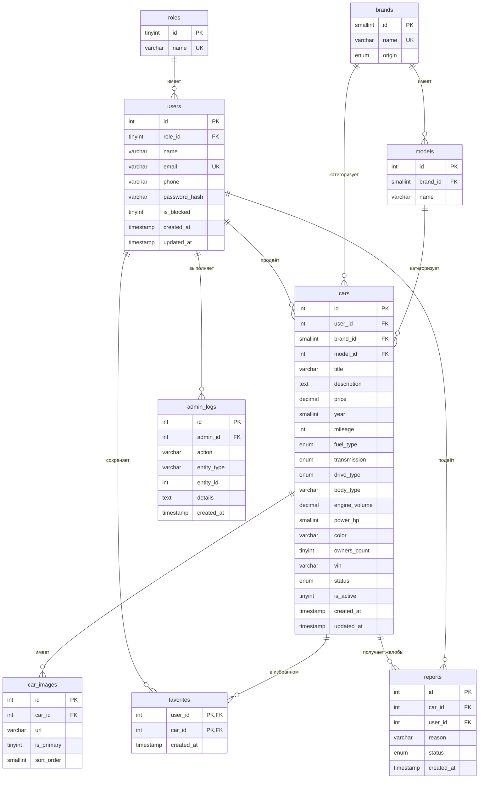

# 5VITO — Проектирование БД и ER-диаграмма

Нормализованная схема MySQL (3НФ), движок InnoDB, сравнение `utf8mb4_unicode_ci`
(полная поддержка кириллицы).

## Сущности

| Таблица       | Назначение                                            |
|---------------|-------------------------------------------------------|
| `roles`       | Справочник ролей (`admin`, `user`) для RBAC           |
| `users`       | Зарегистрированные учётные записи                     |
| `brands`      | Производители; `origin` = отечественный / иномарка    |
| `models`      | Модели, принадлежащие бренду                          |
| `cars`        | Объявления (основная сущность)                        |
| `car_images`  | Галерея фото автомобиля (один-ко-многим)              |
| `favorites`   | Пользователь ↔ Авто, многие-ко-многим (избранное)     |
| `reports`     | Жалобы пользователей на объявление (модерация)        |
| `admin_logs`  | Журнал аудита действий администраторов                |

## ER-диаграмма (Mermaid)

## Связи

- `users.role_id → roles.id` (RESTRICT): у каждого пользователя ровно одна роль.
- `cars.user_id → users.id` (CASCADE): удаление пользователя удаляет его объявления.
- `cars.brand_id → brands.id` (RESTRICT): используемый бренд нельзя удалить.
- `cars.model_id → models.id` (SET NULL): модель необязательна.
- `car_images.car_id → cars.id` (CASCADE).
- Составной первичный ключ `favorites (user_id, car_id)` исключает дубликаты.
- `reports.car_id → cars.id` (CASCADE), `reports.user_id → users.id` (SET NULL).
- `admin_logs.admin_id → users.id` (CASCADE).

## Стратегия индексирования

| Индекс                                  | Обоснование                                  |
|-----------------------------------------|----------------------------------------------|
| `uq_users_email`                        | Поиск при входе + уникальность               |
| `idx_users_phone`                       | Вход по телефону (экран входа из макета)      |
| `idx_cars_status_active`                | Публичный каталог показывает только approved+active |
| `idx_cars_price`, `idx_cars_year`       | Фильтры по диапазону                          |
| `idx_cars_filter (brand_id,price,year)` | Составной индекс под частый комбинированный фильтр |
| `ft_cars_search (title,description)`    | `MATCH … AGAINST` для строки поиска           |
| `idx_brands_origin`                     | Фильтр «Отечественные / Иномарки»             |
| PK `favorites (user_id, car_id)`        | Переключение/дедупликация избранного за O(1)  |

## Замечания по нормализации

- **1НФ**: все столбцы атомарны; изображения галереи вынесены в `car_images`.
- **2НФ**: нет частичных зависимостей (одностолбцовые суррогатные ПК).
- **3НФ**: бренд/модель вынесены в отдельные таблицы; `origin` хранится в
  `brands`, а не дублируется в каждом авто.
